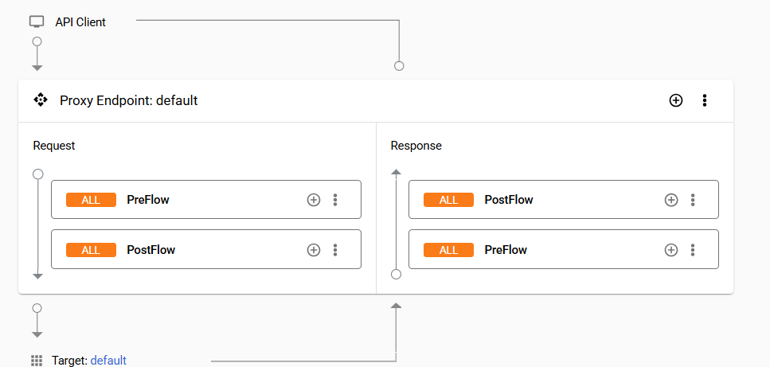
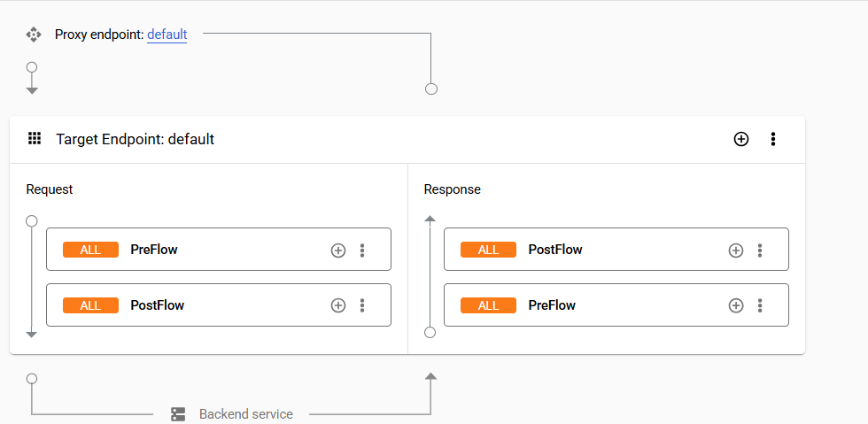

This project is a migration tool from APIGee to Gravitee.
The tool is Command Line based and it uses XML configuration from APIGee to transform it to JSON Gravitee config file.

## Built With

* [Spring Shell](https://spring.io/projects/spring-shell)
* [Maven](https://maven.apache.org/) - Dependency Management

## Getting Started

These instructions will get you a copy of the project up and running on your local machine for development and testing
purposes.

### Prerequisites

* Java JDK 21

### Build and Start the project

The project can be built with the following command:

```
mvn clean packgage
```
 
### Folder Structure
```
Migration/  -- this can be any name
├── ApiProxy/  -- this is the folder of the APIProxy that we are migrating
│   └── apiproxy
└── SharedFlows/  -- this is the folder of the SharedFlows that we are migrating (needs to be SharedFlows), it should contain all the sharedflows used in the APIProxy (it must contain only shared flows inside of it)
    ├── SharedFlow1/
    │   └── sharedflowbundle
    ├── SharedFlow2/
    │   └── sharedflowbundle
    └── SharedFlow3/
        └── sharedflowbundle
```
To start the project, you can use the following command:

```
java -jar migration-tool-0.0.1-SNAPSHOT.jar
```

Available Commands:

```
start Migration/ApiProxy -- based on the example above, this will start the migration of the ApiProxy and SharedFlows
```

To start the application and execute the migration directly navigate to the gravitee-cli folder and execute:

```
java -jar target/migration-0.0.1-SNAPSHOT.jar start folderName
```

The output will be in the location where the tool is started called gravitee_api_output.json

### Flows in Apigee

The pictures below show how the flows in Apigee look like for the proxy endpoint and for the routing rules(target endpoints).

#### Proxy Endpoint


#### Target Endpoint(Routing Rules)


